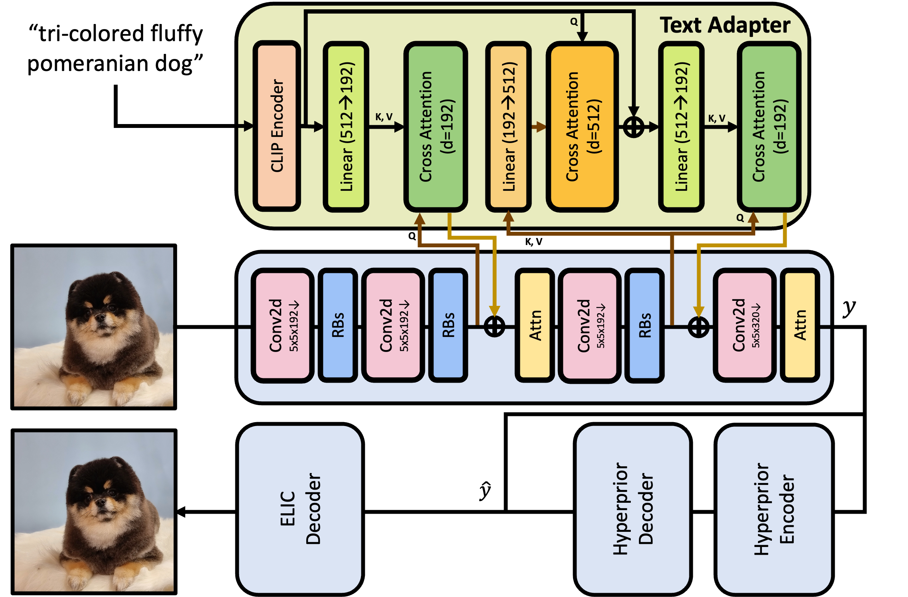

# TACO: <u>T</u>ext-<u>A</u>daptive <u>CO</u>mpression

### [Paper](https://arxiv.org/abs/2403.02944) | [Project page](https://taco-nic.github.io)

<br>

Hagyeong Lee\* $^1$, Minkyu Kim\* $^1$, Jun-Hyuk Kim $^2$, Seungeon Kim $^2$, Dokwan Oh $^2$, Jaeho Lee $^1$ <br><br>
$^1$ Pohang University of Science and Technology (POSTECH)  & $^2$ Samsung Advanced Institute of Technology (SAIT) 

This is the official Github page for the paper "Neural Image Compression with Text-guided Encoding for both Pixel-level and Perceptual Fidelity (ICML 2024)".

## Summary & Architecture
We propose a compression framework that leverages text information mainly by text-adaptive encoding and training with joint image-text loss. By doing so, we avoid decoding based on text-guided generative models---known for high generative diversity---and effectively utilize the semantic information of text at a global level. 

<center>

</center>

## Dataset
This repository does not contain any image datasets used in the manuscript.<br>
We used [Kodak](https://r0k.us/graphics/kodak/), [MS-COCO 30k](https://cocodataset.org/#home), and [CLIC](https://www.compression.cc/) datasets  for our main experiments. (Section 4.1. in our paper for details)

### Downloading MS-COCO Dataset
To download the MS-COCO validation dataset (used for evaluation):
```bash
# Run the provided script to download and extract COCO images and annotations
chmod +x download_val_coco.sh
./download_val_coco.sh
```

This script will:
1. Download the MS-COCO 2014 validation images (~1GB)
2. Download the MS-COCO 2014 annotations (~240MB)
3. Extract files to the appropriate directories
4. Create a compatible caption file for the TACO model

The images will be saved to `coco/val2014/` and the processed caption file to `coco/val2014_captions.json`.

## How to train
For training TACO, you can use the following command:
```
python -u train.py --dist_port (int) --train_dataset_root_path (string) --lpips_coefficient (float) --joint_image_text_loss_coefficient (float) --epochs (int) --learning_rate (float) --aux-learning-rate (float)  --num-workers (int) --lambda (float) --batch-size (int) --patch-size (int int) --seed (int) --clip_max_norm (float) --lr_epoch (int int)  

# e.g. python -u train.py --dist_port 6411 --train_dataset_root_path /data/MSCOCO --lpips_coefficient 3.50 --joint_image_text_loss_coefficient 0.0025 --epochs 50 --learning_rate 1e-4 --aux-learning-rate 1e-3 --num-workers 8 --lambda 0.0004 --batch-size 8 --patch-size 256 256 --seed 100 --clip_max_norm 1.0 --lr_epoch 45 48 
```

<details>
<summary>Details of each arguments are as followings :</summary>

* dist_port: port for using Distributed Data Parallel (DDP) (default: 6006)
* train_dataset_root_path: root folder of training dataset(e.g. MSCOCO)
* lpips_coefficient: coefficient of LPIPS loss (default: 1.0)
* joint_image_text_loss_coefficient: coefficient of joint image-text loss (default: 0.005)
* epochs: Number of epochs (default: 50)
* learning_rate: Learning rate (default: 1e-4)
* aux-learning-rate: Auxiliary loss learning rate (default: 1e-3)
* num-workers: Dataloaders threads (default: 8)
* lambda: Bit-rate distortion parameter (default: 0.0004)
* batch-size: Batch size (default: 8)
* patch-size: Size of the patches to be cropped (default: (256, 256))
* seed: Set random seed for reproducibility
* clip_max_norm: Gradient clipping max norm (default: 1.0)
* lr_epoch: Set epoch to schedule the learning rate (default: 45 48)

</details>

## How to inference 
For testing TACO, you can use the following command:
```
python -u generate_images_using_image_cap_dataset.py --image_folder_root (path for original image data) --checkpoint (path of the model checkpoint)

# e.g. python -u generate_mscoco30k.py --image_folder_root /data/MSCOCO/val2014 --checkpoint /checkpoint/pre_trained_ckpt.pth.tar
```
If you want to download checkpoints, click this [link](https://drive.google.com/drive/folders/1zOLRtr3AMJ2KChCDjCeBicI871Pzw28K?usp=drive_link)

## Docker Environment Setup
For running TACO effectively with GPU acceleration, a Docker environment is recommended. This approach ensures consistent dependencies and optimal performance.

### Prerequisites
- [Docker](https://www.docker.com/products/docker-desktop/) installed on your system
- Docker Compose (included with Docker Desktop)
- NVIDIA GPU with CUDA support
- [NVIDIA Container Toolkit](https://docs.nvidia.com/datacenter/cloud-native/container-toolkit/install-guide.html) (nvidia-docker2)

### Setting Up Docker
1. The repository includes a `Dockerfile` and `docker-compose.yml` for easy setup:

```bash
# Build and start the Docker container
docker-compose up -d

# To view container logs
docker logs -f taco-taco-1
```

2. The Docker setup mounts your local TACO directory to `/app` in the container, along with:
   - `./coco` mounted to `/app/coco` for dataset access
   - Checkpoint files mounted to `/app/checkpoint`

### GPU Acceleration
When running on AWS or other GPU-enabled servers, ensure that the GPU is properly configured to be used by the Docker container:

```bash
# Check if GPU is visible to Docker
docker exec -it taco-taco-1 nvidia-smi
```

If you need to specify the platform explicitly (usually not needed on AWS with NVIDIA GPUs):
```bash
# Build with specific platform 
docker-compose build

# Run with specific configuration
docker-compose up -d
```

### Running Single Image Compression
To compress a single image inside the Docker container:

```bash
docker exec -it taco-taco-1 python run_single_image.py \
    --image_path coco/val2014/COCO_val2014_000000000042.jpg \
    --caption "This wire metal rack holds several pairs of shoes and sandals" \
    --checkpoint checkpoint/lambda_0.0016.pth.tar \
    --output_dir ./output
```


## Citation
```
@inproceedings{lee2024taco,
        title={Neural Image Compression with Text-guided Encoding for both Pixel-level and Perceptual Fidelity},
        author={Lee, Hagyeong and Kim, Minkyu and Kim, Jun-Hyuk and Kim, Seungeon and Oh, Dokwan and Lee, Jaeho},
        booktitle={International Conference on Machine Learning},
        year={2024}
```

## Contact
If you have any questions, please feel free to contact Hagyeong Lee (hagyeonglee@postech.ac.kr) or Minkyu Kim (minkyu.kim@postech.ac.kr).
